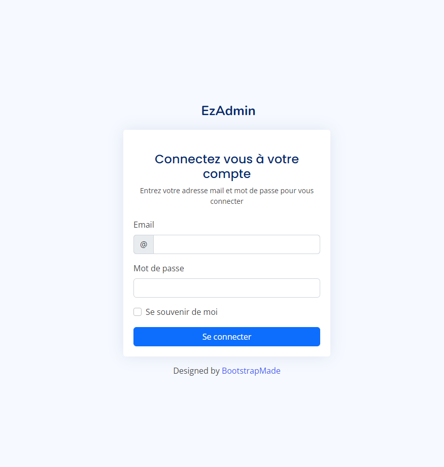
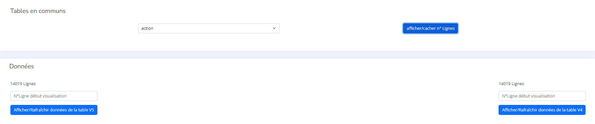

## Requirements 

Node v19 et + installé.
NPM 9.5 et + installé.
Postgresql v15 et +.

Crée sous : 
OS - Windows 11


## Comparateur bdd pgsql / Easy Admin

Guide d'installation :  
Installation de node js v19.6.1 - https://nodejs.org/en/download/current   
NodeJS et Npm v 9.4.0 - https://nodejs.org/fr/download  
Installation de postgresql v15 - https://www.postgresql.org/download/windows/  
Installation de MongoDB Compassa - https://www.mongodb.com/docs/manual/installation/  
Installation de Mongosh - https://www.mongodb.com/docs/mongodb-shell/  
  
Après l'installation de mongosh il sera important de créer une collection renduPro et de créer un utilisateur qui a les droits readWrite sur renduPro avec le nom "rio" et l mdp : "dossierPro". 
Si vous désirez le faire autrement il faudra changer les lignes de connections dans les configs. ("mongoUrl")  

  

Présentation:
GUI de gestion de base de donnée pour une autre interaction et meilleures récupérations des scripts

Pour pouvoir avoir deux bases de données sur laquelle travaillé une fois que vous avez créer un utilisateur sur votre pgsql, vous pouvez créer deux nouvelle bases de données avec les commandes :  

Au prèalable:
psql -U postgres  
CREATE database projet_pro_demo_1  
CREATE database projet_pro_demo_2  
\q   

psql -U postgres -d projet_pro_demo_1 -a -f .\dump-projet_pro_demo_1-202307031104.sql
psql -U postgres -d projet_pro_demo_2 -a -f .\dump-projet_pro_demo_2-202307031106.sql

Pour lancer l'application il vous faudra aprés avoir cloné ce repos, rentrer dans le dossier BddCompare avec la commande suivante :  
```
cd BddCompare
```

Ensuite il faudra installer toutes les dépendances npm en lançant la commande d'installation des librairies: 
```
npm install  
```

Une fois l'installation des librairies effectuées, vous pouvez lancer le projet à partir de la racine du dossier BddCompare, en faisant la commande suivante:  
```
node app.js  
```

Le dossier sera ouvert sur votre localhost le port 3000.

A noter, si jamais un bug quelconque tel que la non visualisation de données/schémas/table pouvait venir, il est possible que l'utilisateur défini dans le dossier des connections strings dans le document router.js ne dispose pas des droits nécessaires a la réalisation de cette tâche.  

Il est important d'avoir un superuser dans la base de données ayant la visibilité sur tout. 

commande pour softia par exemple :   

```
DO $$ DECLARE
    database_name text;
    schema_name text;
    table_name text;
BEGIN
    FOR database_name IN (SELECT datname FROM pg_database WHERE datistemplate = false) LOOP
        FOR schema_name IN (SELECT s.schema_name FROM information_schema.schemata s WHERE s.schema_name NOT LIKE 'pg_%' AND s.schema_name <> 'information_schema') LOOP
            FOR table_name IN (SELECT t.table_name FROM information_schema.tables t WHERE t.table_schema = schema_name) LOOP
                EXECUTE 'GRANT SELECT ON TABLE ' || schema_name || '.' || table_name || ' TO softia;';
            END LOOP;
        END LOOP;
    END LOOP;
END $$;
```
## Sécurité mise en place

Pour éviter une surconsommation des ressources et des éventuelles spam dans les machines disposant des bases de données à visualiser, une sécurité de base déja mis en place par les bases de données limitent le nombre de sessions. Si trop de sessions sont actives en même temps, il se peut que l'application cesse de fonctionner par rapport aux environnements concernées. Si cela vient à arriver veuillez redémarrer les services de base de données des machines concernées.

# Fonctionnalitées présentes

Pour utiliser l'application à son plein escient il est important de suivre ces étapes.

## 1 - Système d'authentification/sécurité et protection des routes

Il est possible d'utiliser l'application si et seulement si l'utilisateur est connecté. Autrement il n'est pas possible d'utiliser l'application.



Une fois connecté via les identifiants et mot de passe qu'on vous a connecté. Vous serez face à l'application. 


## 2- Récupération dynamique des urls d'environnement des machines distantes  


Possibilité de choisir deux bases de données avec des onglets select. L'url et l'environnement choisi est précisé dans le select. 


Le bouton d'affichage et bouton de rafraîchissement est le même bouton. 


## 3- Récupération des schémas des bdd choisies

Possibilité d'afficher les schémas des deux bases de données choisies.   
Le bouton d'affichage et bouton de rafraîchissement est le même bouton.


## 4- Récupération des tables 


 
Select avec les tables en communs des deux schémas choisis. 
Une fois une table choisi, cliquez sur afficher/cacher n° Lignes.



## 5- Affichage des données 

Pour afficher les données il faut d'abord insérer le N° de ligne de visualisation à partir duquel vous voulez visualiser la bdd.  Ce numéro doit aller de 1 jusqu'au maximum du nombre de lignes afficher juste au dessus de la ligne. (Ici 14019). 


Une fois que vous avez réalisé cette tâche, vous pouvez afficher les données de la table choisie. L'application affiche les 25 premieres données, ordonnées par ordre croissant par rapport à la 2eme colonne, à partir du numéro entré dans la case "N Ligne début visualisation". 
On y affiche que 25 pour le moment car la capacité de RAM demandée pour afficher plus de données est trop importante. 


Le bloc bleu clair correspond au données de la "v5", le bloc gris correspond aux données de la "v4".

## 6- Comparaison des données

Pour finir vous avez une dernière fonctionnalité de comparaison. 
Elle reprendra les numéros de ligne de visualisation entré sur la section supérieure et comparera les 25 données des deux bases de données choisies par rapport à leur schémas et tables.


Possibilité de créer un excel de la comparaison désiré en cliquant sur le boutton "Créer un excel de la comparaison". 


## En guise d'amélioration...  

Pour développement futur réalisation d'un événement javascript, interdissant la modification des bases de données dans l'url tant que l'utilisateur n'a pas décider de rafraîchir ses schémas.  
Amélioration du visuel.  
Plus grande ram nécessaire pour l'affichage de plus de données.


